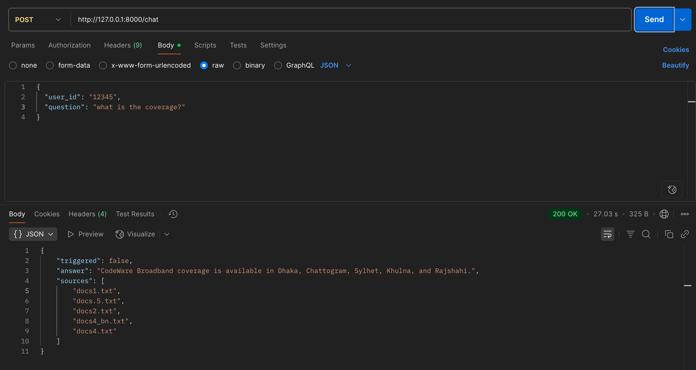
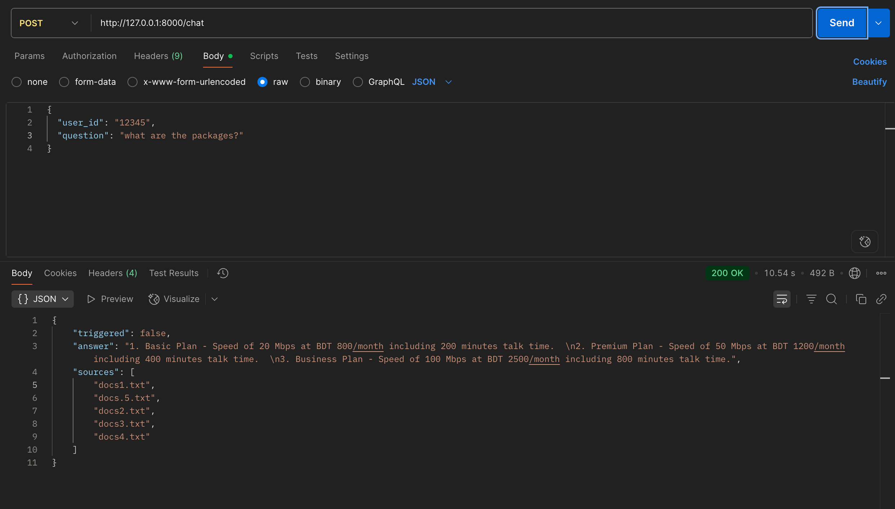
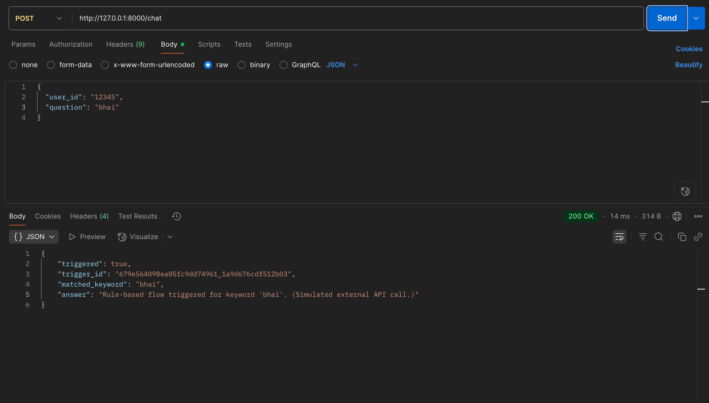

# CodeWare RAG Chatbot (Python Backend Engineer AI/RAG Focus)

A modular Q&A chatbot API that combines:
- **RAG pipeline** (LangChain + ChromaDB + Ollama local LLM)
- **Rule-based flow trigger** (from `codeware_bot_flow.json`)

Supports Bangla, English, and Banglish queries.

---

## Features
- **Rule-based flow:** Triggers external API for service flows (Packages, Bill Pay, New Connection, etc.)
- **RAG pipeline:** Semantic search over company docs, answer generation via local LLM
- **Modular code:** SOLID, DRY, easy to extend

---

## Setup Instructions

### 1. Prerequisites
- Python 3.10+
- [Ollama](https://ollama.com/) installed and running (for local LLM)
- Conda or venv for Python environment
- (Recommended) Mac M1: use a small/quantized Ollama model (e.g., `phi3:Mini`)
- This codebase uses `phi3:Mini`. If u wish to use any other models, you can just change it in `config.py`

### 2. Clone & Environment
```bash
# Clone the repo
# git clone <your-repo-url>
cd directory

# Create and activate environment
conda create -n chatbot-rag python=3.10 -y
conda activate chatbot-rag

# Install dependencies (conda)
conda install --file requirements.txt
# (Optional, to silence deprecation warnings, use pip for these two only if needed)
# pip install -U langchain-chroma langchain-ollama
```

### 3. Prepare Data
- Place your company info `.txt` files in the `company_info/` folder.
- Ensure `codeware_bot_flow.json` is present in the project root.

### 4. Ingest Data (Embedding)
```bash
python embed_company_info.py
```
- This will chunk, embed, and store your docs in ChromaDB (`chromadb_store/`).

### 5. Start Ollama (if not running)
```bash
ollama serve &
ollama pull phi3:mini  # or another small model
```

### 6. Run the API Server
```bash
uvicorn app:app --reload
```

---

## API Endpoints

### POST `/chat`
**Input:**
```json
{
  "user_id": "12345",
  "question": "I want to know about packages"
}
```

**Logic:**
1. Checks for rule-based triggers (Packages, Bill Pay, etc.)
   - If matched, calls `/chatbot` and returns trigger info.
2. Otherwise, runs RAG pipeline (semantic search + LLM answer).

**Response (RAG):**
```json
{
  "triggered": false,
  "answer": "Our packages include Basic, Premium, and Business plans...",
  "sources": ["doc1.txt", "doc2.txt"]
}
```
**Response (Rule-based):**
```json
{
  "triggered": true,
  "trigger_id": "...",
  "matched_keyword": "Packages",
  "answer": "Rule-based flow triggered for keyword 'Packages'. (Simulated external API call.)"
}
```

### POST `/chatbot`
**Input:**
```json
{
  "user_id": "12345",
  "trigger_id": "..."
}
```
**Response:**
```json
{
  "user_id": "12345",
  "trigger_id": "...",
  "message": "Simulated external API response for trigger_id ..."
}
```

---

## Example Usage

**Test with curl:**
```bash
curl -X POST http://127.0.0.1:8000/chat \
  -H "Content-Type: application/json" \
  -d '{"user_id":"u1","question":"What packages do you offer?"}'
```

---

## Notes
- For best performance on Mac M1, use a quantized/small Ollama model.
- If you see deprecation warnings, install the new adapters as above.
- To extend: add new flows to `codeware_bot_flow.json` or new docs to `company_info/` and re-run embedding.

---

## Submission
- Push code to a GitHub repo.
- Include this README.
- Ensure all endpoints and logic match the project spec.

## Postman Example

Below are some Postman examples for interacting with the chatbot:

1. 
2. 
3. 


# Discussion

English works fine for both trigger-flow-based and LLM based Q&A. To enable bangla Language support I alternate the embedding model from `all-MiniLM-L6-v2`
to `csebuetnlp/banglishbert`. But still the accuracy did not increase. I tried to increase chunk size and relevent info grouping for better chunking. Though it seem to have a good effect but not quite.
I have found the problem. The string match for Bangla language not working. I think resolving this will ensure the Bangla Q&A.